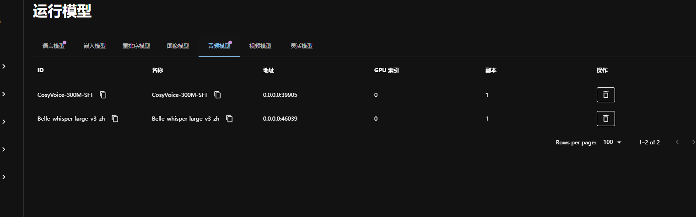

## 一. 安装ollama 部署模型

```bash
# linux
curl -fsSL https://ollama.com/install.sh | sh
```

## 二. 安装pgvector

```bash
docker run -d  --name m-postgres -e POSTGRES_USER=root -e POSTGRES_PASSWORD=123456 -p 5433:5432 ankane/pgvector:latest
# 创建数据库
CREATE DATABASE "maxkb";  

\c "maxkb";

# 创建表
CREATE EXTENSION "vector";

```

## 三. 项目启动

这边通过编写docker打包为一个独立的隔离环境(不需要格外的操作)

1. 拉取源码

```bash
git clone https://github.com/kaisersama112/llm-know-server.git
```

2. 打包部署

```bash
docker build -t llm-know-app:v1.0 -f installer/Dockerfile .
```

3. 镜像启动

```bash
docker run -d --name llm-know-container-v2 -p 8080:8080 llm-know-app:v2.0 
```

### 四. 项目环境配置

1. python==3.11
2. pip install poetry
3. poetry install

### 五. 启动项目

#### 1. 启动服务端

```bash
python main.py dev
```

#### 2. 启动前端

```bash
npm run dev
```

#### 3. 启动本地模型服务

```bash
python main.py dev local_model
```

#### 4. 启动异步服务

```bash
python main.py dev celery
```

## 数据导出

```bash
docker cp 8d984bd0cae9:/opt/maxkb/app/data /root/llm-know-server-v3/exported_data
```

## 数据导入

```bash
docker cp /root/llm-know-server-v3/exported_data/. 97ed576f9dc2:/opt/maxkb/app/data/
```

# 数据迁移(直接文件覆盖方案（同主版本适用）)

1. 停止v4容器

```bash
docker stop llm-know-container-v4
```

2. 备份v4当前数据

```bash
# 创建备份目录
mkdir -p /root/llm_backup/v4

# 备份数据卷
docker run --rm -v 89f67dc2244595338b26f04a629b390237bc3484964dfff16514edfc436181a2:/data -v /root/llm_backup/v4:/backup alpine tar czf /backup/v4_data_$(date +%Y%m%d).tar.gz -C /data .

```

3. 执行覆盖操作

```bash
# 启动临时同步容器
docker run -d --rm \
  --name data_overwriter \
  -v 06411d3762406e3df46c68878ad872e5bd9f9687d25462ec7fb07eac34759928:/source \
  -v 89f67dc2244595338b26f04a629b390237bc3484964dfff16514edfc436181a2:/target \
  alpine tail -f /dev/null

# 清空v4数据卷并复制v3数据
docker exec data_overwriter sh -c "rm -rf /target/* && cp -a /source/* /target/"

# 验证文件数量
docker exec data_overwriter sh -c "find /source -type f | wc -l"
docker exec data_overwriter sh -c "find /target -type f | wc -l"
```

4. 重启v4容器

```bash
docker start llm-know-container-v4
```

# 监控启动日志

```bash
docker logs -f llm-know-container-v4 | grep -i 'database system is ready'
```
